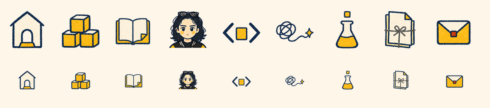

# MZ Icon Design

An independent, review-first agent Skill for creating coherent MZ interface icons and expressive spot-icon systems.



## Three production tracks

| Track | Best for | Output |
| --- | --- | --- |
| `mz-line-v1` | Navigation, buttons, compact UI at 16–32 px | Original SVG with light/dark previews |
| `mz-crayon-v2` | Sections, features, categories, empty states | Hand-drawn transparent PNG spot icons |
| `mz-block-v1` | Technical products and spatial concepts | Isometric block-style transparent PNG icons |


The Skill routes requests by intended use and display size, validates every output, and stops at `READY_FOR_REVIEW`. It does not silently publish assets or claim user acceptance.

## Install

Install the stable release with Codex:

```text
$skill-installer install https://github.com/MuziGeek/mz-icon-design/tree/v1.0.0/mz-icon-design
```

Install the current main branch:

```text
$skill-installer install https://github.com/MuziGeek/mz-icon-design/tree/main/mz-icon-design
```

## Try it

```text
Use $mz-icon-design to create a 24px search icon for navigation.
Use $mz-icon-design to create nine crayon spot icons for a personal portfolio.
Use $mz-icon-design to audit these SVG icons against the MZ design system.
```

## Reliability

- Explicit routing between UI SVG and two spot-icon styles.
- Static SVG validation plus 16/24/32 px visual review.
- Transparent-edge, clipping, size, and QA-sheet checks for PNG sets.
- Manifest states that distinguish drafts, blocked generation, validation failure, and review readiness.

## Languages

- English (this page)
- [简体中文](README.zh-CN.md)

## License

Code and documentation are MIT licensed. MZ reference artwork uses the [MZ Reference Asset License 1.0](ASSET_LICENSE.md). See [NOTICE.md](NOTICE.md) for the file-level boundary.
