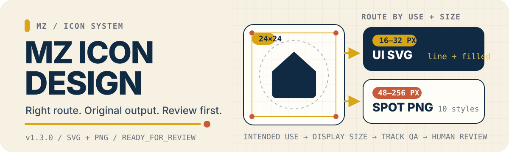
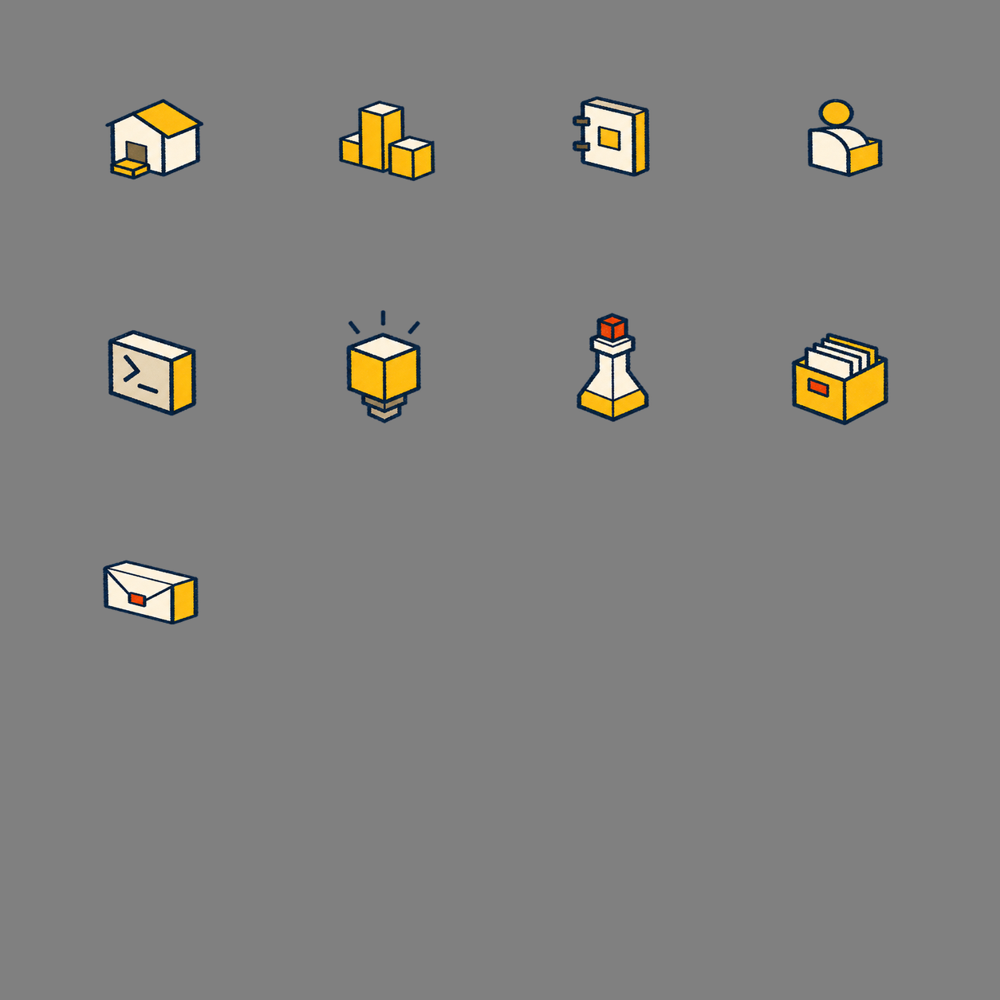
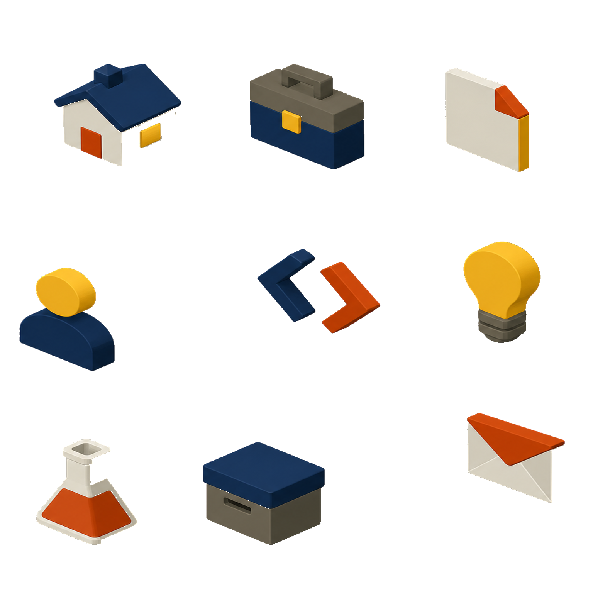
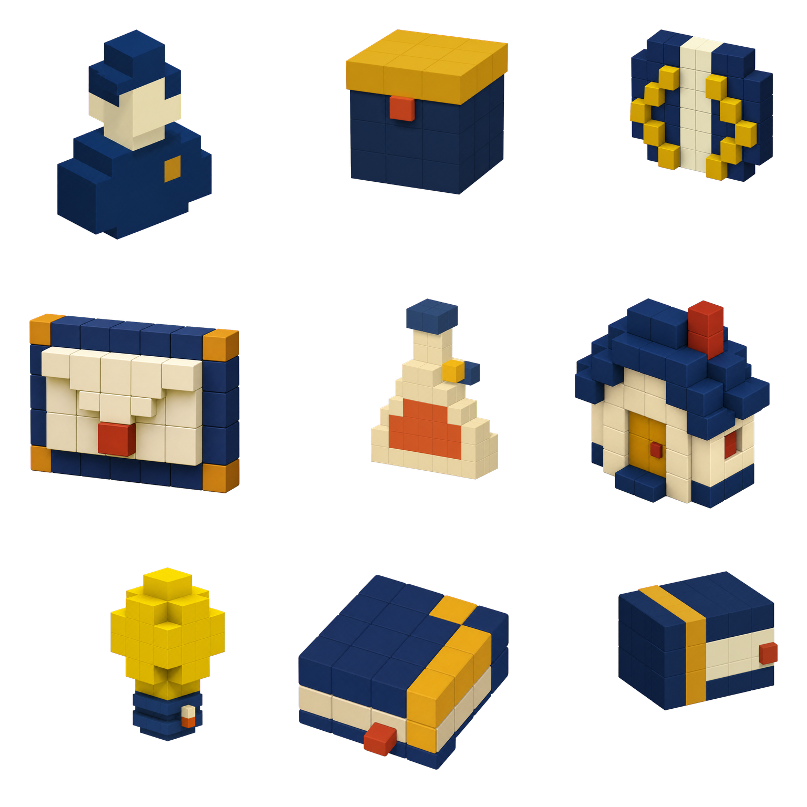
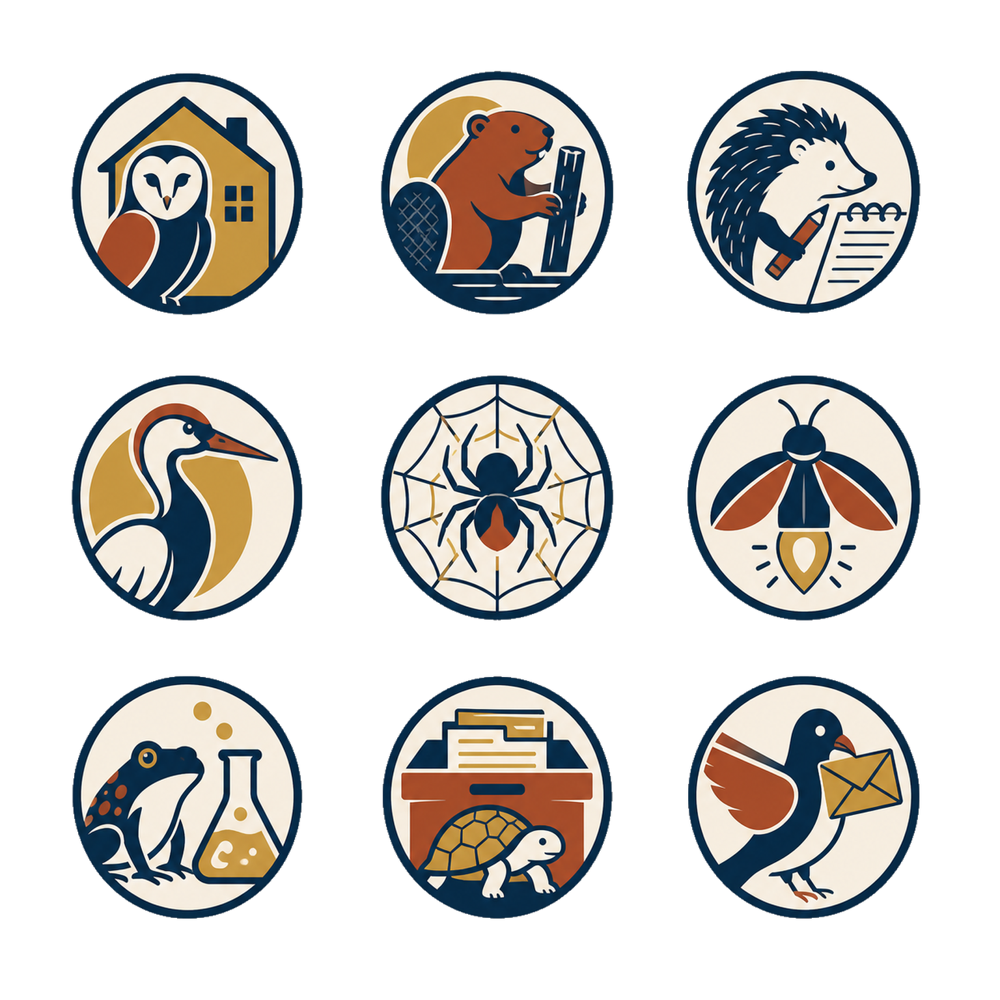

<p align="right"><a href="README.md">English</a></p>

<p align="center">
  
</p>

# MZ Icon Design

一个请求，进入正确的生产路线，交付可评审的图标。

MZ Icon Design 是一个独立、评审优先的 Agent Skill，用于创建统一的界面图标与具有表现力的 Spot 图标系统。它会根据用途和显示尺寸自动路由，验证每个输出，并停在 `READY_FOR_REVIEW`。

## 先看真实成果



<details>
<summary><strong>浏览其他已批准 Spot 风格</strong></summary>

### MZ Soft 3D


### MZ Colorblock


### MZ Isometric



### MZ Macro Voxel



### MZ Sticker


### MZ Cartoon


### MZ Animal Badge



### MZ Realistic


</details>

## 根据用途和尺寸选择

| 路线 | 适用场景 | 输出 |
| --- | --- | --- |
| `mz-line-v1` | 16–32 px 导航、按钮与紧凑 UI | 原创 SVG 与明暗预览 |
| `mz-filled-v1` | 明确要求实心 UI 图标或实心字形的 16–32 px 场景 | 原创 `currentColor` SVG 与明暗预览 |
| `mz-crayon-base-v1` | 栏目、功能、分类与空状态 | 身份中立的手绘透明 PNG Spot 图标 |
| `mz-block-v1` | 技术产品与空间概念 | 等距积木风透明 PNG 图标 |
| `mz-soft-3d-v1` | 明确要求柔和 3D 或哑光黏土的概念 | 原创透明 PNG Spot 图标 |
| `mz-colorblock-v1` | 明确要求 Colorblock 或撞色色块的概念 | 原创透明 PNG Spot 图标 |
| `mz-isometric-v1` | 明确要求柔和等距微缩物的概念 | 原创透明 PNG Spot 图标 |
| `mz-voxel-macro-v1` | 明确要求 Macro Voxel 或抛光亚克力体素的概念 | 原创透明 PNG Spot 图标 |
| `mz-sticker-v1` | 明确要求 Sticker 或模切贴纸的概念 | 原创透明 PNG Spot 图标 |
| `mz-cartoon-v1` | 明确要求友好 Cartoon 图标的概念 | 原创透明 PNG Spot 图标 |
| `mz-animal-badge-v1` | 明确要求一次性动物隐喻徽章的概念 | 原创透明 PNG Spot 图标 |
| `mz-realistic-v1` | 明确要求简化写实物件的概念 | 原创透明 PNG Spot 图标 |

用户明确指定的 Mode 或 Style 始终优先。未指定风格的单个图标默认使用 SVG；未指定风格的一组图标默认使用 `mz-crayon-base-v1` Spot 路线。人物或品牌身份只能通过显式提供且兼容的 Extension 生效。

## 两条路线，分别执行 QA

### UI SVG · 16–32 px

创建原创 24×24 图标，校验几何与风格，在明暗背景中检查 16/24/32 px 显示效果，最后验证 Batch Manifest。只有静态检查不能进入 `READY_FOR_REVIEW`。

### Spot PNG · 48–256 px

锁定一种已批准风格，生成受控 4×4 Sheet，切分目标图标，校验透明度与裁切，再检查洋红、黑色、奶油色背景以及 48 px、96 px QA 预览。

## 安装

使用 Codex 从 `main` 安装当前 v2.0.0 代码：

```text
$skill-installer install https://github.com/MuziGeek/mz-icon-design/tree/main/mz-icon-design
```

仓库当前声明 v2.0.0 的公共 Extension 接口。

## 第一次使用

```text
Use $mz-icon-design to create a 24px search icon for navigation.
Use $mz-icon-design to create nine identity-neutral crayon spot icons for a portfolio.
Use $mz-icon-design to audit these SVG icons against the MZ design system.
```

## 评审边界

- UI SVG 接受静态校验，以及多尺寸、明暗背景视觉复核。
- PNG 集合接受透明边缘、裁切、尺寸与 QA Sheet 检查。
- Manifest 区分 `DRAFT`、`GENERATION_BLOCKED`、`VALIDATION_FAILED` 与 `READY_FOR_REVIEW`。
- Skill 不会静默发布资产，也不会冒充用户验收。

## MZ Visual Engine 交接

Skill 可以接收可选的已校验 `mz.visual-brief/1`。公共 Brief 选择公共路线；私有命名空间风格只有在显式提供 Extension 且哈希有效时才能生效。任何路线都不能绕过原创性、SVG/PNG QA、Manifest 或用户评审要求。

## 许可证

代码与文档使用 MIT 许可证；MZ 参考图像使用 [MZ Reference Asset License 1.0](ASSET_LICENSE.md)。具体边界见 [NOTICE.md](NOTICE.md)。
